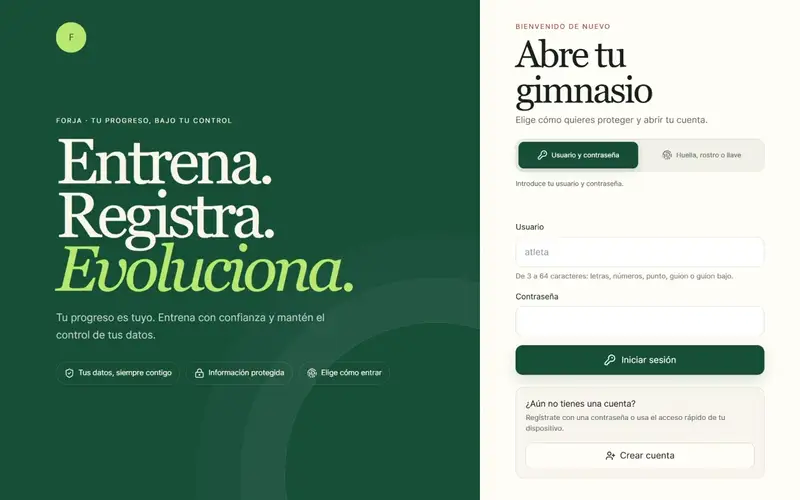
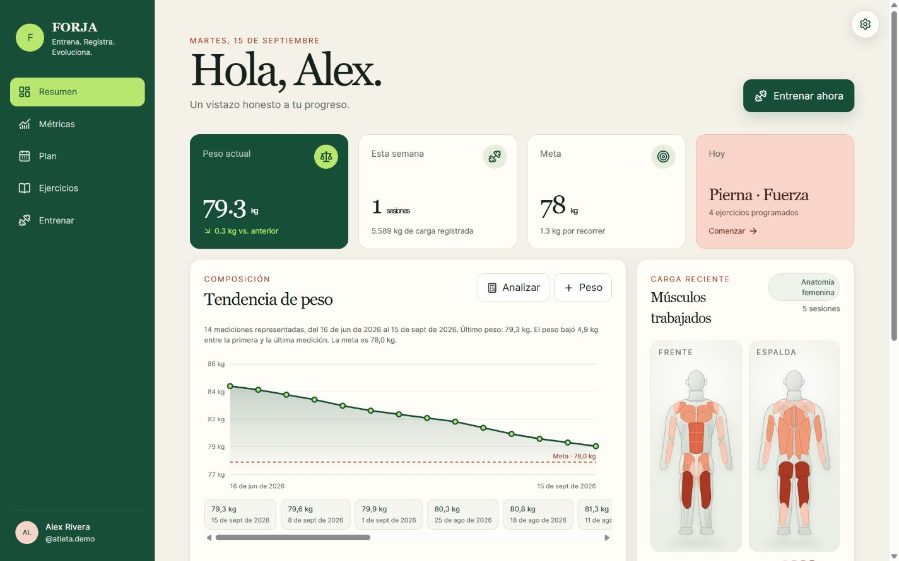
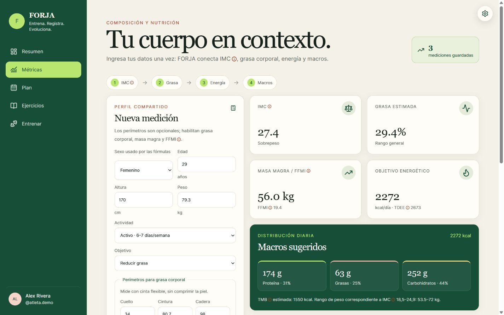
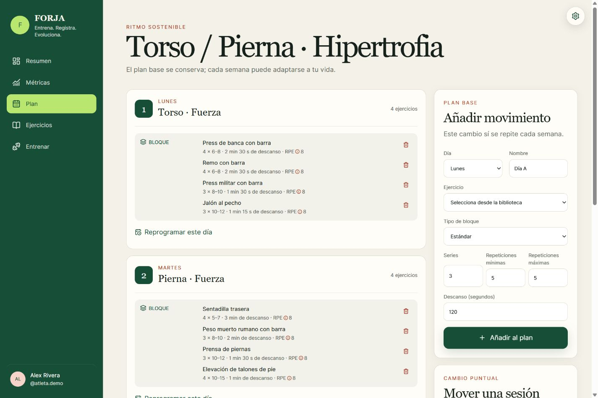
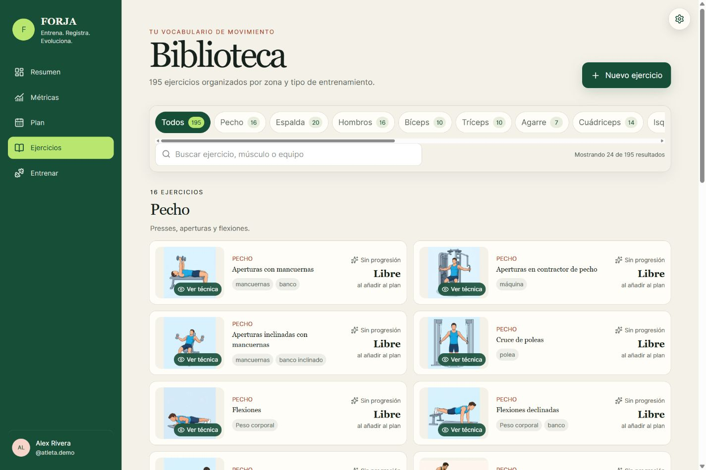
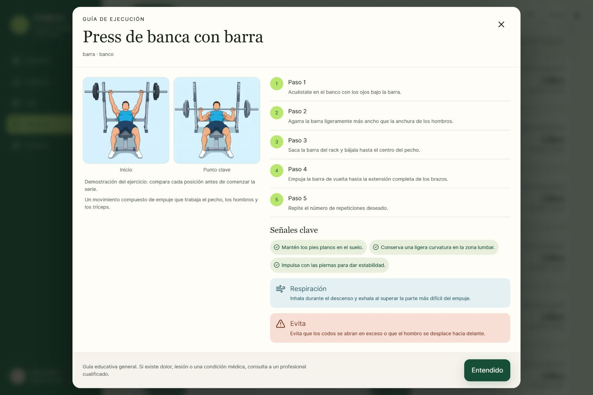
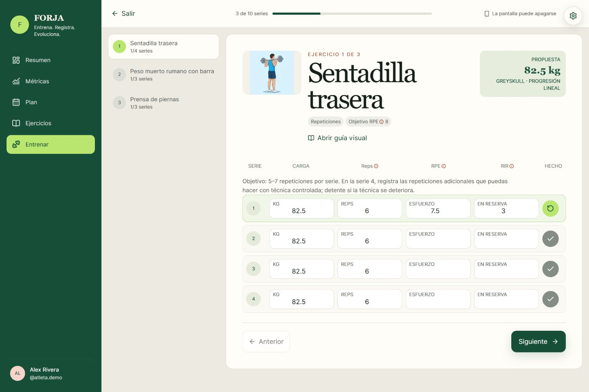
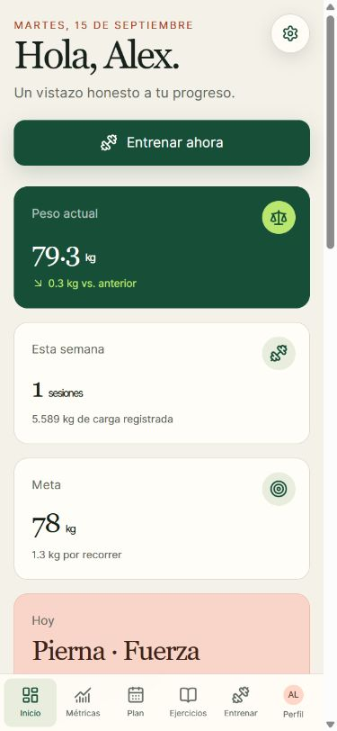

# FORJA

> Entrena. Registra. Evoluciona.

FORJA es una aplicación web instalable para planificar entrenamientos, registrar cada serie y seguir la evolución del peso y la composición corporal. Puedes crear una cuenta con usuario y contraseña, añadir una passkey para entrar con tu dispositivo y conservar tus datos en una instalación propia o en Vercel + Neon.

[](docs/media/forja-tour.mp4)

[Ver recorrido completo (video, 24 s)](docs/media/forja-tour.mp4) · [Ver el modo de entrenamiento (video, 11 s)](docs/media/forja-training.mp4) · [Ver la pantalla de acceso](docs/media/forja-login.jpg)

Los videos son montajes silenciosos de capturas de la interfaz, no grabaciones de interacción en tiempo real. El perfil y las mediciones mostrados son ficticios; no se usaron datos de usuarios reales.

## Lo que puedes hacer

- **Empezar a tu manera:** crea una cuenta con usuario y contraseña, registra una o varias passkeys y administra tus métodos de acceso. El asistente inicial solicita objetivos, disponibilidad y contexto corporal solo en el primer ingreso; puedes abrirlo de nuevo desde la interfaz para revisar los datos y regenerar el plan sin borrar tus sesiones.
- **Entrenar con un plan propio:** organiza la semana y reprograma días concretos sin modificar el plan base. El generador considera objetivo, experiencia, equipo, prioridades y movimientos sensibles para proponer una rutina de 2 a 6 días.
- **Encontrar y entender cada ejercicio:** explora 195 ejercicios base distribuidos en 16 categorías, con búsqueda, filtros y guías visuales autoalojadas. Puedes crear ejercicios propios y adjuntar una imagen. Las demostraciones base usan imágenes estáticas en lugar de GIF; los movimientos personalizados sin imagen se identifican claramente.
- **Registrar el trabajo real:** el entrenamiento guiado recupera cargas previas, registra series, repeticiones o tiempo, descansos y esfuerzo opcional mediante RPE/RIR. Solicita mantener la pantalla encendida cuando el dispositivo admite Wake Lock. Calcula el 1RM estimado y propone cargas con progresión lineal, Greyskull LP o doble progresión, incluyendo estancamientos y descargas.
- **Seguir tus avances:** consulta tendencia de peso y meta, constancia anual, carga reciente y mapa muscular. Registra perímetros y compara estimaciones de IMC, grasa corporal, masa magra, FFMI, gasto energético y macronutrientes. Un recordatorio mensual ayuda a repetir las mediciones.
- **Usarla como PWA:** instala la web, vuelve a abrir pantallas y guías consultadas sin conexión y sincroniza cambios pendientes cuando regresa la red. Las notificaciones Web Push pueden avisar de descansos y mediciones si el navegador y el usuario lo permiten; su entrega no sustituye una alarma garantizada.

RPE significa *escala de esfuerzo percibido* y RIR, *repeticiones en reserva*. La interfaz incluye ayuda contextual para estas y otras abreviaturas. Las estimaciones de composición y nutrición son orientativas, no un diagnóstico ni una prescripción clínica.

## Un vistazo a la interfaz

| Panel y constancia | Métricas y composición |
| --- | --- |
|  |  |
| Evolución, meta, actividad y grupos musculares. | Perímetros, historial y estimaciones encadenadas. |

| Plan semanal | Biblioteca de ejercicios |
| --- | --- |
|  |  |
| Rutina por días y cambios de fecha independientes. | Búsqueda, categorías y ejercicios personalizados. |

| Guía visual | Entrenamiento guiado |
| --- | --- |
|  |  |
| Imagen y pasos para reconocer el movimiento. | Series, carga sugerida, esfuerzo y descansos. |



Las capturas son una muestra de la versión actual y pueden variar ligeramente con cambios posteriores de la interfaz.

## Empezar en local con Docker

Necesitas Docker con Compose. El proxy Nginx reúne la web y `/api` bajo `http://localhost:8080`, lo que permite probar WebAuthn en `localhost`. Por defecto, el puerto se vincula a `127.0.0.1` y no se publica en toda la red.

1. Copia `.env.example` a `.env` y configura `SESSION_SECRET`, `VAPID_PUBLIC_KEY` y `VAPID_PRIVATE_KEY`. No versiones `.env`. Puedes generar los valores con Node.js y la utilidad de Web Push:

   ```sh
   node -e "console.log(require('node:crypto').randomBytes(48).toString('base64url'))"
   npx web-push generate-vapid-keys
   ```

2. Deja `RP_ID=localhost`, `EXPECTED_ORIGIN=http://localhost:8080` y `PUBLIC_APP_URL=http://localhost:8080` si usarás el puerto predeterminado. Ajusta también `APP_PORT` y el origen exacto si cambias de puerto.
3. Inicia la aplicación:

   ```sh
   docker compose up -d --build
   ```

4. Abre [http://localhost:8080](http://localhost:8080) y crea tu cuenta. Comprueba los contenedores con `docker compose ps` si la página no responde.

Para detenerla sin eliminar los datos, ejecuta `docker compose stop`. El modo local guarda las cuentas y credenciales en `data/db.json` y el estado de cada usuario en `data/state-<id>.json`; ambos se excluyen de Git. Los ejemplos de estructura son [`data/db.example.json`](data/db.example.json) y [`data/state-user.example.json`](data/state-user.example.json).

> Antes de exponer Docker a Internet, coloca un proxy HTTPS delante, fija el dominio de WebAuthn y sigue las medidas de [operación y copias de seguridad](docs/production.md). No compartas el directorio JSON entre varias réplicas del backend.

## Publicar en Vercel + Neon

La configuración de producción sirve el frontend y `/api` desde un mismo dominio HTTPS. La función Node usa Neon PostgreSQL para cuentas, passkeys, sesiones y estados; QStash programa avisos de descanso y un cron diario recupera tareas y procesa recordatorios de perímetros. En Vercel no se utiliza el almacenamiento JSON local.

Sigue la [guía paso a paso de Vercel + Neon](docs/vercel-neon.md) para conectar la base de datos, configurar QStash y Web Push, elegir el dominio, preparar las variables y validar el despliegue. Como mínimo, revisa `DATABASE_URL`, `RP_ID`, `EXPECTED_ORIGIN`, `PUBLIC_APP_URL`, `SESSION_SECRET`, VAPID, QStash y `CRON_SECRET`. El dominio de una passkey debe permanecer estable: cambiarlo después de registrar usuarios puede impedir que esas credenciales vuelvan a funcionar.

Si ya tienes datos JSON, la guía incluye una migración con modo de simulación. El repositorio contiene la configuración para desplegarse; no implica que exista una instancia pública activa.

## Desarrollo y verificación

Se requiere Node.js 24. Desde la raíz:

```sh
npm ci
npm run typecheck
npm test
npm run build
npm run build --workspace=backend
node scripts/qa/verify-precache.mjs
```

Para una comprobación de contenedores con datos temporales y Docker operativo, ejecuta `node scripts/qa/compose-smoke.mjs`. La [guía de producción](docs/production.md) amplía las comprobaciones, las copias de seguridad y los límites conocidos.

| Componente | Ubicación | Responsabilidad |
| --- | --- | --- |
| Web React, Vite y PWA | [`frontend/`](frontend/README.md) | Pantallas, estado local, Service Worker y recursos de ejercicios. |
| API Node y dominio | [`backend/`](backend/README.md) | Autenticación, persistencia, sesiones, entrenamientos y Push. |
| Despliegue serverless | [`api/[...path].ts`](api/%5B...path%5D.ts), [`vercel.json`](vercel.json) | API bajo el mismo origen que la PWA. |
| Instalación local | [`docker-compose.yml`](docker-compose.yml), [`nginx.conf`](nginx.conf) | Proxy Nginx, frontend, backend y archivos JSON. |
| Medios de este README | [`docs/media/`](docs/media/) | Capturas, vista previa animada y videos de demostración. |

## Privacidad, alcance y créditos

FORJA no exige una app nativa ni un servicio de correo para crear una cuenta. Las contraseñas se almacenan como derivaciones con sal; no hay recuperación automática por correo. Conserva tus métodos de acceso y realiza copias protegidas. Las respuestas privadas de `/api` no se guardan en la caché del Service Worker. Los JSON locales contienen datos personales sin cifrar a nivel de archivo; en producción debes controlar el acceso, la retención y las copias de Neon.

Las calculadoras toman inspiración funcional de [Body_Calc](https://github.com/castellanosfelipe/Body_Calc). Los datos de ejercicios proceden de [RepDB](https://repdb.co) y parte de las imágenes complementarias de [Free Exercise DB](https://github.com/yuhonas/free-exercise-db). Consulta [avisos y licencias de terceros](THIRD_PARTY_NOTICES.md) para los recursos incluidos.
